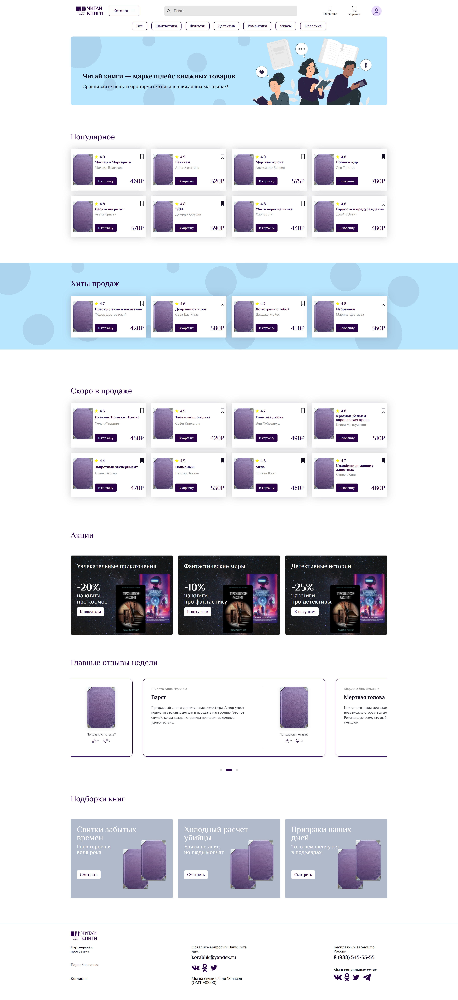
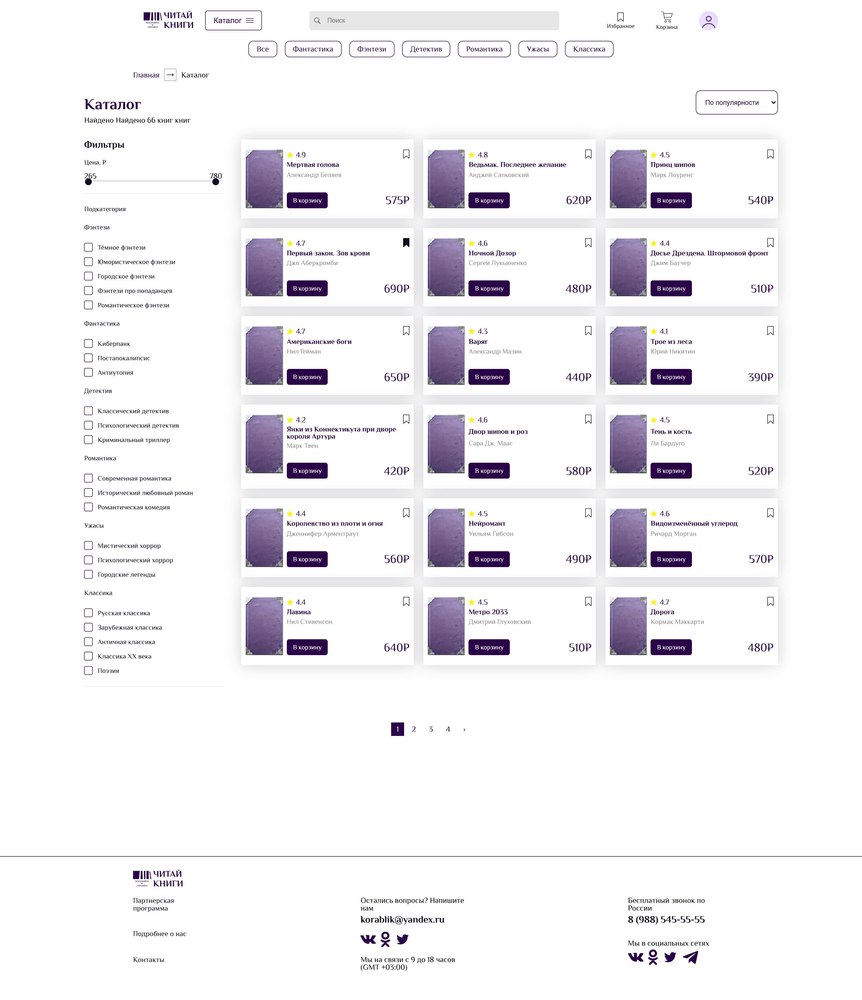
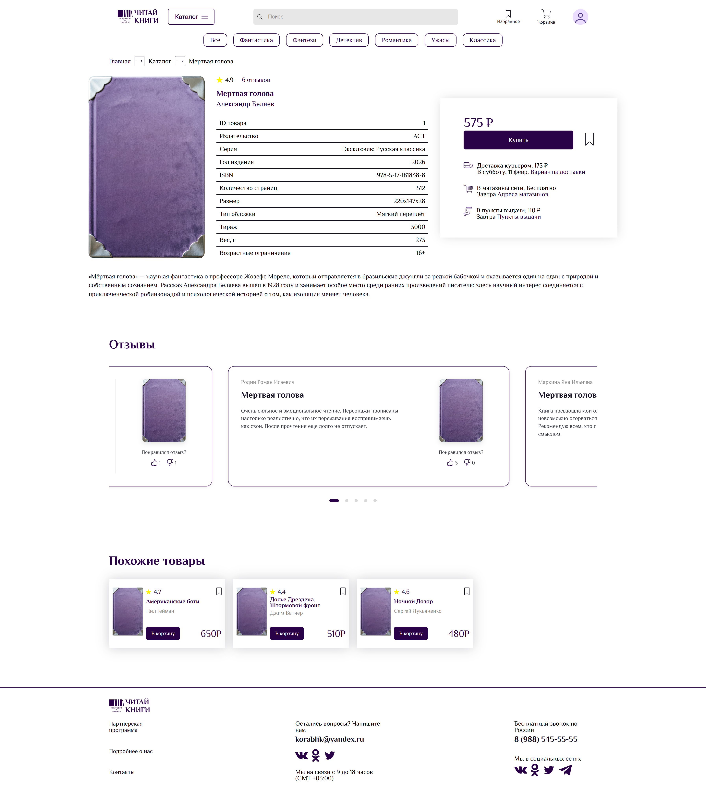
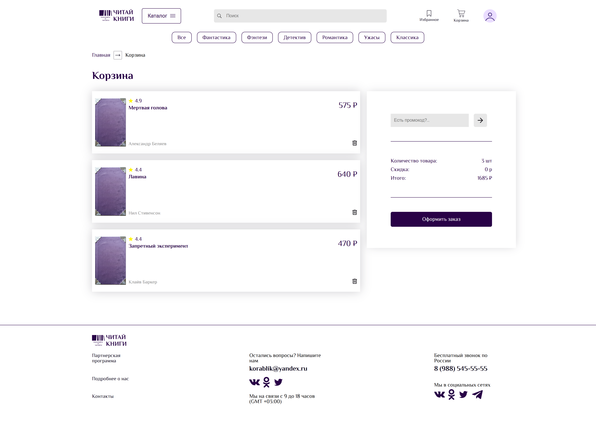
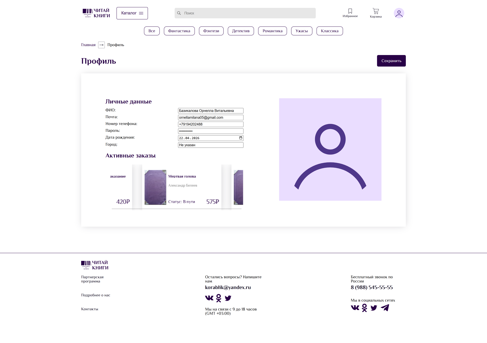
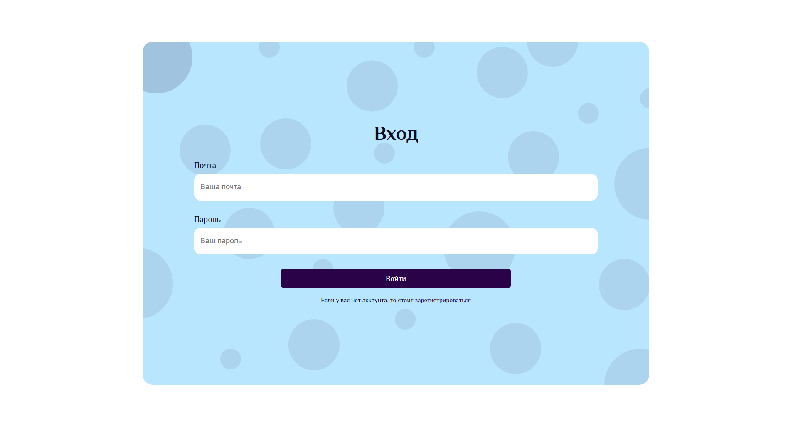
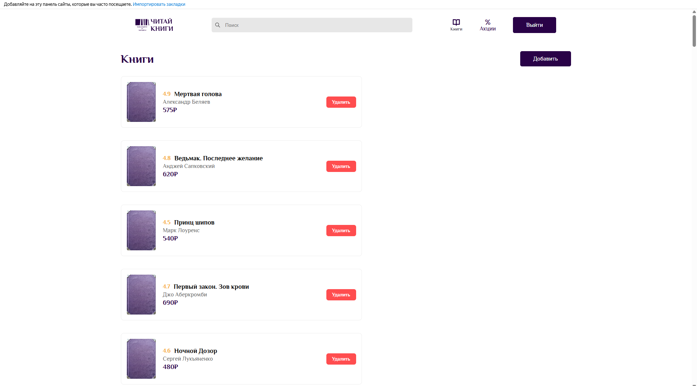
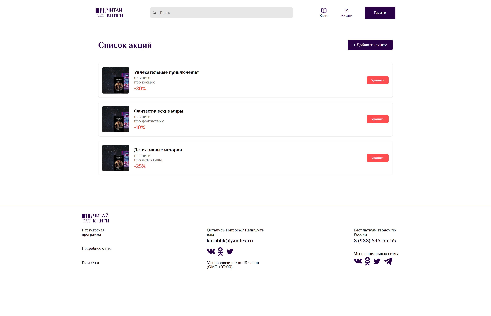

# Читай книги

Интернет-магазин книг: каталог с фильтрами, страница товара, корзина с промокодами и оформлением заказа, избранное, отзывы, акции, личный кабинет и админ-панель.

**Демо:** 

## Возможности

**Для покупателя**
- Каталог с фильтрами по жанру и подкатегории, слайдером цены и постраничной навигацией
- Страница книги с подробными характеристиками и блоком «Похожие товары»
- Корзина: добавление и удаление, подсчёт итоговой суммы
- Промокоды (`BOOK10`, `BOOK15` — скидка в процентах, `BOOK500` — фиксированная скидка)
- Оформление заказа с адресом доставки
- Избранное
- Отзывы с лайками и дизлайками
- Акции на главной странице
- Регистрация и вход с валидацией форм
- Профиль: редактирование данных, загрузка аватара, список заказов
- Адаптивная вёрстка (десктоп и мобильные устройства)

**Для администратора**
- Список книг с удалением и форма добавления новой книги
- Список акций с удалением и форма добавления акции

## Скриншоты

### Каталог

### Страница книги

### Корзина и оформление заказа

### Профиль

### Вход и регистрация

  
  

### Админ-панель

 
 

## Технологии

- HTML5, CSS3 (БЭМ-именование классов)
- JavaScript (ES6+), без фреймворков
- [Swiper](https://swiperjs.com/) — слайдеры
- Google Fonts (Bad Script, Caveat, Philosopher)

##  Что реализовано на фронтенде

Проект написан на чистом JavaScript (ES6+) без использования фреймворков, с акцентом на модульность, производительность и чистый код.

### Архитектура и код
- **Модульная структура:** Логика разделена по зонам ответственности (`basket.js`, `categories.js`, `user.js` и др.), что упрощает поддержку и масштабирование.
- **Методология БЭМ:** Строгое именование CSS-классов для изоляции стилей и предотвращения конфликтов.
- **Работа с DOM:** Динамический рендеринг карточек товаров, фильтров, пагинации и отзывов через нативный JavaScript.

###  UI/UX и вёрстка
- **Адаптивность:** Полная поддержка десктопных и мобильных разрешений (Flexbox/Grid).
- **Интерактивность:** Интеграция библиотеки `Swiper` для слайдеров, кастомные анимации и состояния элементов (hover, active, disabled).
- **Работа с формами:** Клиентская валидация данных при регистрации и входе, обработка загрузки и отображения аватара.

###  Ролевая модель
- Реализовано разделение интерфейсов и доступов для обычного пользователя и администратора.

## Структура проекта

bookstore/
├── *.html            страницы
├── css/              reset.css, style.css
├── js/
│   ├── data.js       данные книг, корзина, избранное, карточки
│   ├── categories.js жанры, фильтры каталога, пагинация
│   ├── basket.js     корзина, промокоды, заказ
│   ├── favourites.js избранное
│   ├── reviews.js    отзывы и реакции
│   ├── stocks.js     акции
│   ├── user.js       профиль и заказы
│   ├── form.js       валидация регистрации
│   ├── login.js      вход
│   ├── main.js       шапка, меню пользователя, слайдер
│   └── api.js        слой для работы с API (в разработке)
├── images/           иконки и изображения
